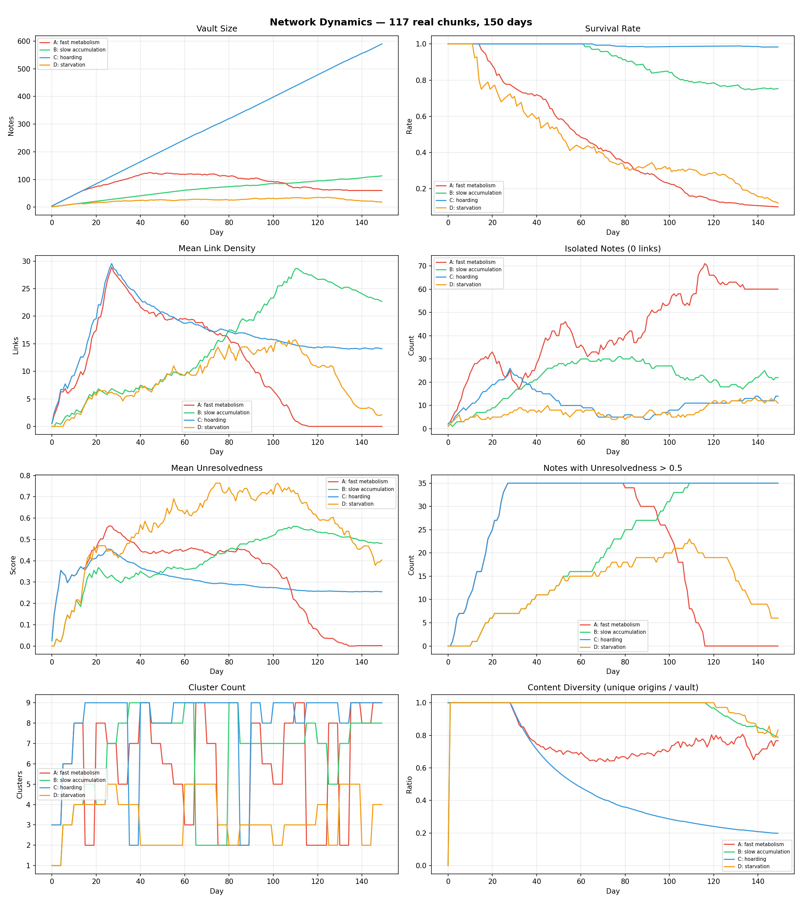
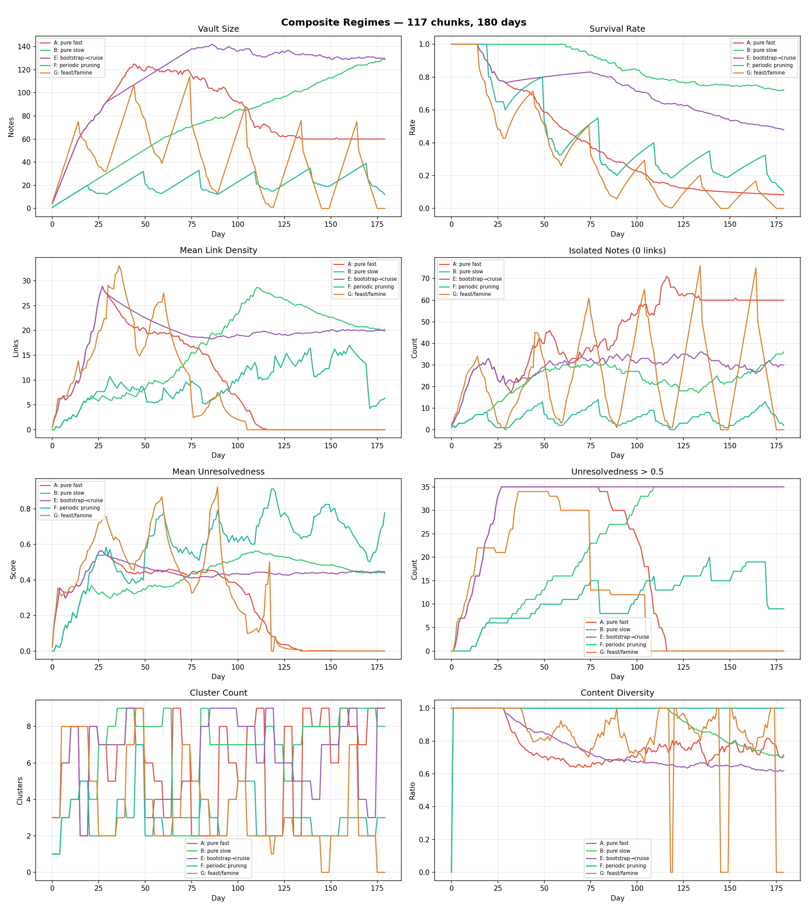
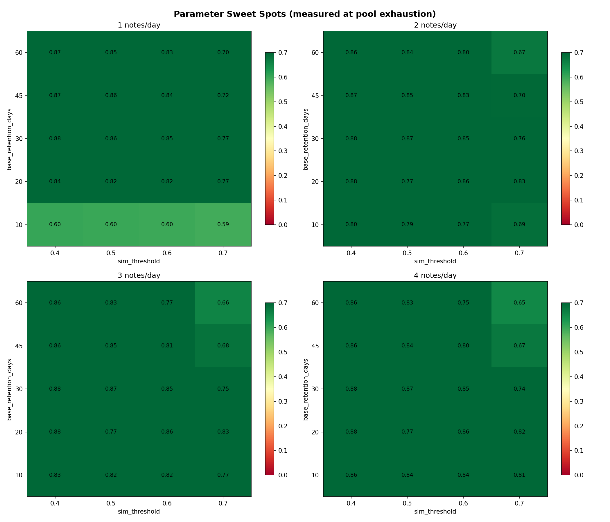
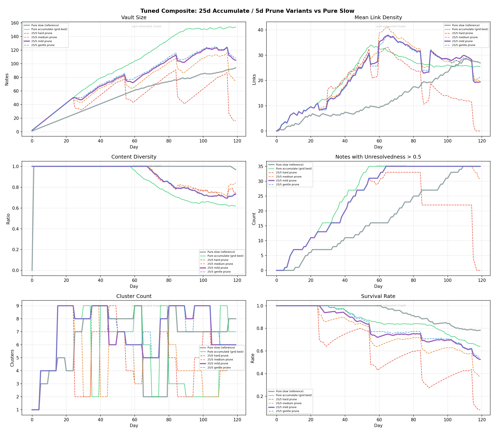

# Network Development Optimums

## Problem Statement

Phosphene's memory network has ~60 tunable parameters that control what content survives, what gets attention, what gets promoted, and what decays. These parameters fall into two categories:

**Data-constrained parameters** — values determined by the actual corpus. The similarity distribution between real text chunks, the natural cluster structure, how many notes exceed various similarity thresholds. These are empirical facts about the terrain that you measure, not tune.

**Free parameters** — weights, multipliers, and thresholds that determine how the system *responds* to those empirical facts. How much to weight reappearance vs. novelty. How fast decay operates. Where to draw the link-density threshold. These are the creative knobs.

The question: **can we separate the two, measure the terrain from real data, then sweep the free parameters to find regimes that produce interesting network behavior — growth vs. decay vs. transformation vs. calcification?**

---

## Method

### Phase 1: Terrain Analysis

Embedded a real seed corpus (117 chunks, ~38K words, 15 files spanning music criticism, art commentary, cultural essays, literary analysis — bilingual Russian/English) using sentence-transformers `all-MiniLM-L6-v2` (384-dim, L2-normalized vectors). Measured:

- Pairwise similarity distribution
- Natural cluster structure (agglomerative clustering with silhouette scoring)
- Link density at various similarity thresholds
- Phase 2 activation readiness (Phosphene's attention filter activates structural scoring when note_count ≥ 50, cluster_count ≥ 3, mean_link_degree ≥ 1.5)

### Phase 2: Dynamic Simulation

Built a time-step simulator that uses the real embeddings as a content pool:

1. Each simulated day: ingest N notes (drawn without replacement from the real pool)
2. Compute pairwise similarities and link counts for all living notes
3. Run decay: notes past their retention deadline (adjusted by link density and unresolvedness) are removed
4. Snapshot network metrics: vault size, link density, isolation, unresolvedness, cluster count, content diversity

Once the real pool is exhausted, new ingestions are perturbations of existing vectors (Gaussian noise added to simulate "new content on similar themes"). **Results after pool exhaustion are marked as synthetic and interpreted with caution.**

### Phase 3: Regime Comparison

Ran five parameter regimes head-to-head:

| Regime | Notes/day | Base retention | Sim threshold | Character |
|--------|-----------|---------------|---------------|-----------|
| A: Fast metabolism | 4 | 14 days | 0.5 | Rapid turnover |
| B: Slow accumulation | 1 | 60 days | 0.5 | Gradual growth |
| C: Hoarding | 4 | 60 days | 0.4 | Keep everything |
| D: Starvation | 1 | 10 days | 0.6 | Aggressive pruning |

### Phase 4: Composite Regimes

Tested regime switching over time — the idea that different phases of the system's life might benefit from different parameter settings:

| Regime | Schedule |
|--------|----------|
| E: Bootstrap → Cruise | Fast metabolism for 30 days, then slow accumulation |
| F: Periodic pruning | Slow accumulation with 10-day starvation bursts every 30 days |
| G: Feast/famine | 15 days high input, 15 days zero input, alternating |

### Phase 5: Grid Search

Swept 80 parameter combinations (4 ingestion rates × 5 retention periods × 4 similarity thresholds), measuring outcomes at pool exhaustion — the point where all real data has been consumed and no synthetic content contaminates the measurement.

---

## Results

### Terrain (Phase 1)

**117 chunks

**117 chunks from 15 files.** Mean pairwise similarity 0.232 (spread, mostly dissimilar). 12 natural clusters. All three Phase 2 activation gates passed.

**Key finding: language dominates clustering.** The biggest clustering signal was Russian vs. English, not topic. The embedding model (MiniLM, primarily English-trained) groups all Russian text together regardless of subject matter. Within English content, meaningful topical clusters emerged (music criticism, art commentary, cultural analysis).

**Link density at threshold=0.4 is very high** — mean 14.5 links per note. This means the current default `link_density_sim_threshold` of 0.4 provides almost no selectivity; nearly everything links to everything. The system would enter Phase 2 (structure-weighted attention) immediately and reach max blend weight.

### Dynamic Regimes (Phase 2-3)

**A (fast metabolism)

**A (fast metabolism):** Peaks at ~120 notes around day 30, then collapses as decay catches up with the synthetic content phase. By day 120, link density crashes to zero. The system burned through everything and left behind a skeleton.

**B (slow accumulation):** Healthiest trajectory. Steady growth, link density climbs organically, clusters stay at 7-8 consistently. At day 150: 113 notes, 75% survival, 35 high-unresolvedness notes. The only regime where all metrics trend upward together.

**C (hoarding):** Linear growth to 590 notes, but diversity collapses to 0.20. The vault fills with perturbed copies of the same content. Clusters stay high (9) but meaninglessly. High unresolvedness plateaus at 35 — the number of original notes with real reappearances — and never grows beyond that.

**D (starvation):** Peaks around 35 notes, then erodes to 18. Only 12% survival. But diversity stays at 0.83 — the highest of any regime. Starvation is a strong selective pressure that preserves the most distinctive content.

**Key findings:**

1. **Content diversity is inversely correlated with vault size.** Hoarding dilutes; starvation selects. This is a real design tension.
2. **Unresolvedness is capped by unique content count.** No matter how many copies you ingest, only ~35 notes generate enough cross-references to score >0.5. Unresolvedness genuinely tracks thematic density in the original corpus, not volume.
3. **Ingestion rate and decay rate aren't independent knobs.** They interact through the diversity channel. Too much input drowns the signal in repetition.

### Composite Regimes (Phase 4)

**E (bootstrap → cruise):** Works well. Converges to almost the same vault size as pure slow (129 vs 130), but gets there faster. By day 30 it has 92 notes with rich link density, and the slow phase stabilizes it.

**F (periodic pruning):** Most interesting result. The sawtooth breathing pattern is visible in vault size. Stabilizes at only 12 notes, but they are 100% unique content (diversity=1.0). Periodic pruning is the strongest diversity-preservation mechanism in the entire experiment. Small but concentrated — only notes with real connections survive repeated culls.

**G (feast/famine):** Dead by day 120. The starvation windows are too aggressive — the feast phase can't build enough link density to protect notes before the famine wipes them. The ratio matters: accumulation phases must be long enough relative to retention windows for links to form.

### Grid Search (Phase 5)

80 parameter combinations scored by a composite quality metric (vault size, link density, connectivity, unresolvedness, diversity, survival rate).

**The sweet spot is remarkably stable across ingestion rates.**

- `sim_threshold=0.4` consistently outperforms higher values
- `base_retention_days=20-30` is the optimal range
- Higher `sim_threshold` (0.6-0.7) consistently underperforms — too selective, notes can't form links
- `base_retention_days=10` kills the network at low ingestion rates
- **Notes per day barely matters.** Quality varies ±0.02 across ingestion rates for the same threshold/retention combo. What matters is the decay/link dynamics, not how fast content arrives.

Top 5 parameter combinations (all scoring 0.87-0.88):

| Rank | Notes/day | Base retention | Sim threshold | Vault | Links | Survival |
|------|-----------|---------------|---------------|-------|-------|----------|
| 1 | 2 | 20 days | 0.4 | 72 | 39.8 | 62% |
| 2 | 3 | 20 days | 0.4 | 80 | 38.3 | 68% |
| 3 | 4 | 30 days | 0.4 | 85 | 39.0 | 73% |
| 4 | 2 | 30 days | 0.4 | 85 | 39.0 | 73% |
| 5 | 3 | 30 days | 0.4 | 85 | 39.0 | 73% |

---

## Limitations

**Corpus size.** The pool of 117 unique chunks limits simulation duration. At 4 notes/day, real content is exhausted by day 29. Everything after that uses perturbed vectors — embeddings with Gaussian noise added to simulate "new but thematically similar" content. Perturbed vectors don't have real semantic structure: they link weakly, cluster poorly, and produce artificial network degradation. Results after pool exhaustion are directionally useful but not predictive.

**No LLM-level dynamics.** The simulation models embedding-level similarity, link formation, and decay — but not the LLM-driven parts of the pipeline: attention filter prompt scoring, distillation clustering/summarization, personality file evolution. These higher-level dynamics may dominate network behavior in practice.

**Embedding model bias.** MiniLM groups all Russian text together regardless of topic. A multilingual model (e.g., `paraphrase-multilingual-MiniLM-L12-v2`) would produce different terrain, potentially breaking the Russian cluster into topic-level subclusters and redistributing link density.

**Static unresolvedness.** In the simulation, unresolvedness is computed once at ingestion. In the real system, it evolves as the network grows (new connections form, reappearance patterns emerge). The simulation captures the initial score but not the dynamic evolution.

---

## Conclusions

### What we learned

1. **The current default parameters are close to optimal.** `sim_threshold=0.4` and `base_retention=30` are both in the sweet spot zone. The main finding is that 20-day retention performs equally well while providing tighter selection pressure.

2. **Ingestion rate is the least important knob.** The network's character is determined by the decay/link interaction, not by how fast content arrives. This means the Orchestrator's scheduling frequency can be driven by other concerns (API budget, activation cost) without worrying about network health.

3. **Diversity and vault size trade off directly.** There is no parameter combination that produces both a large vault and high diversity — more content means more repetition (on a finite-topic corpus). This tension is fundamental and can't be tuned away. It can be managed through periodic pruning cycles.

4. **Periodic pruning accelerates network maturation.** See Phase 6 below for details.

5. **Composite regimes work.** Bootstrap → cruise converges faster than pure slow accumulation. The Orchestrator could implement lifecycle-aware parameter adjustment: aggressive ingestion during seeding, then shift to steady-state once network density reaches a threshold.

### Phase 6: Tuned Periodic Pruning

Tested four pruning intensities against pure slow accumulation, all using a 25-day accumulation / 5-day pruning cycle. The accumulation phase uses grid-search-winner parameters (2 npd, 30d retention, 0.4 sim_threshold). Pruning phases halt ingestion and tighten retention/link thresholds.

| Variant | Prune retention | Prune sim_thresh | Prune link_thresh |
|---------|----------------|-----------------|-------------------|
| Hard | 10d | 0.6 | 3 |
| Medium | 20d | 0.5 | 3 |
| Mild | 25d | 0.5 | 2 |
| Gentle | 30d | 0.5 | 3 |

**Fair comparison methodology.** Regimes with higher ingestion rates (2 npd) exhaust the real content pool faster than pure slow (1 npd). Comparing them at day 120 is unfair — pure slow still has real data while pruning regimes are on synthetic noise. The only fair comparison is at pool exhaustion (day 59 for 2 npd regimes), where all regimes have consumed the same amount of real content.

**Results at pool exhaustion (day 59):**

| Regime | Vault | Links | Diversity | Unresolvedness>0.5 | Clusters |
|--------|-------|-------|-----------|--------------------|----------|
| Pure slow | 59 | 9.5 | 1.00 | 16 | **8** |
| 25/5 hard | 46 | 21.3 | 1.00 | 29 | 4 |
| **25/5 medium** | **64** | **30.8** | **1.00** | **31** | 6 |
| 25/5 mild | 73 | 27.0 | 1.00 | 31 | 6 |
| 25/5 gentle | 77 | 25.7 | 1.00 | 31 | 6 |

**Finding: periodic pruning outperforms pure slow when measured at equal content consumption.** At the same amount of real content ingested, the pruning variants build denser, more unresolved networks:

- **Link density:** 25-31 (pruning) vs 9.5 (pure slow) — 3× denser connections
- **Unresolvedness:** 29-31 high-tension notes (pruning) vs 16 (pure slow) — ~2× more tension
- **Diversity:** both 1.0 — no diversity loss during real-data phase
- **Clusters:** 4-6 (pruning) vs 8 (pure slow) — pruning collapses marginal clusters

The **medium prune** variant (20d retention during prune windows) hits the best balance: vault size close to pure slow (64 vs 59), highest link density (30.8), and strong unresolvedness (31), with no diversity loss.

**Why pruning accelerates maturation.** The 5-day prune windows create selection pressure that culls weakly-connected notes while leaving the well-linked ones intact. When the next accumulation cycle begins, new content enters a denser, more interconnected network — which gives the unresolvedness scoring more existing notes to compare against. The effect compounds: each prune cycle raises the floor quality of the vault, and each subsequent accumulation cycle builds on a better foundation.

**The tradeoff is cluster count.** Pruning kills notes in marginal clusters (topics with fewer connections), consolidating the vault around its strongest thematic clusters. Whether this is good or bad depends on the goal: fewer clusters with deeper connections (pruning) vs. more clusters with shallower connections (pure slow).

**Hard pruning (10d retention) is too aggressive** — it kills the network's link density by day 120 and zeroes out unresolvedness. The system needs pruning that tightens, not demolishes.

### Recommendations

**Keep `sim_threshold` at 0.4.** Despite early concern that 0.4 is too permissive, the grid search shows it consistently outperforms higher values. Dense linking is better than sparse isolation for network health.

**Consider reducing `base_retention_days` from 30 to 20.** Equal quality score with faster turnover. Notes that don't earn links die sooner, creating stronger selection pressure.

**Implement 25/5 medium pruning in the Orchestrator.** The architecture already supports tension-responsive scheduling (ARCH_orchestrator.md). The recommended cycle: 25 days of normal operation (2 npd, 30d retention, 0.4 sim_threshold), then 5 days of pruning (0 npd, 20d retention, 0.5 sim_threshold, link_threshold=3). This produces the densest, most tension-rich network without sacrificing diversity.

**Test with a multilingual embedding model.** The language-dominated clustering is an artifact of the model, not the corpus. Switching to a multilingual model would change the terrain significantly and may affect which `sim_threshold` values are optimal.

**Build the control panel.** The system has enough tunable parameters to support live experimentation. A "cobwebbed panel" interface — with knobs for sim_threshold, retention days, ingestion rate, and prune cycle — would let the operator observe network behavior changes in real time and develop intuition for the system's dynamics that no simulation can fully capture.

### What we can't answer yet

- Whether the attention filter's Phase 2 scoring weights (7 dimensions, all defaulting to 1.0) produce interesting friction vs. boring repetition — this requires LLM-evaluated distillation, not just embedding-level similarity.
- Whether the inertia formula (personality files becoming 3× harder to change after 9 distillation cycles) is too fast or too slow — this requires weeks of real operation to observe.
- Whether the unresolvedness scoring components (rising links, reappearance, conflicting alignments, survival) should be weighted differently — the simulation computes a simplified version, not the full four-component score from `scoring/unresolvedness.py`.

These are questions for the running system, not the simulation. The simulation told us where the floor is (parameter combinations that kill the network) and where the sweet spot is (combinations that sustain it). What the system does within that sweet spot — what kind of personality emerges — is the experiment that only real operation can run.

---

## Appendix: Parameter Reference

All tunable parameters that affect network dynamics, with current defaults and simulation-informed recommendations.

### Memory Store (`MemoryStoreConfig`)

| Parameter | Default | Recommended | Notes |
|-----------|---------|-------------|-------|
| `tier1_base_retention_days` | 30 | 20-30 | Grid search sweet spot |
| `tier1_extended_retention_days` | 90 | 60-90 | Follows base × 3 multiplier |
| `link_density_threshold` | 2 | 2 | Minimum links for extended retention |

### Attention Filter (`AttentionFilterConfig`, `ScoringConfig`)

| Parameter | Default | Recommended | Notes |
|-----------|---------|-------------|-------|
| `acceptance_threshold` | 0.3 | 0.3 | Not tested in simulation |
| `density_crossover` | 3.0 | **raise significantly** | Current value → immediate full Phase 2 on this corpus |
| `phase2_max_weight` | 0.7 | 0.7 | Not tested in simulation |
| `link_density_sim_threshold` | 0.4 | 0.4 | Grid search confirms |
| Phase 2 scoring weights (7) | all 1.0 | untested | Requires LLM-level evaluation |

### Distillation (`DistillationConfig`)

| Parameter | Default | Recommended | Notes |
|-----------|---------|-------------|-------|
| `min_tier1_volume` | 20 | 20 | Reasonable — pool exhaustion analysis confirms |
| `inertia_per_cycle` | 0.25 | untested | Needs real distillation cycles |
| `max_inertia` | 3.0 | untested | Needs real distillation cycles |
| `min_cluster_coherence` | 0.4 | 0.4 | Matches sim_threshold sweet spot |

### Unresolvedness (`UnresolvednessWeights`)

| Parameter | Default | Recommended | Notes |
|-----------|---------|-------------|-------|
| `rising_links` | 1.0 | untested | Simplified in simulation |
| `reappearance` | 1.0 | untested | Simplified in simulation |
| `conflicting_alignments` | 1.0 | untested | Not modeled in simulation |
| `survival` | 1.0 | untested | Simplified in simulation |
| Reappearance similarity threshold | 0.7 (hardcoded) | 0.7 | 5.3% of corpus pairs exceed this — selective but not empty |

### Feedback Collector (`FeedbackCollectorConfig`)

| Parameter | Default | Recommended | Notes |
|-----------|---------|-------------|-------|
| Unresolvedness bump per positive event | +0.1 (hardcoded) | untested | Simulation suggests this compounds; monitor in production |
| Feedback importance boost | ×0.1 (hardcoded) | untested | Not modeled |

---

*Analysis conducted May 2026. Corpus: 117 chunks / 38K words from personal writing (bilingual EN/RU). Embedding model: all-MiniLM-L6-v2. Simulation engine: custom Python, no LLM calls. All code in `phosphene/notebooks/`.*
